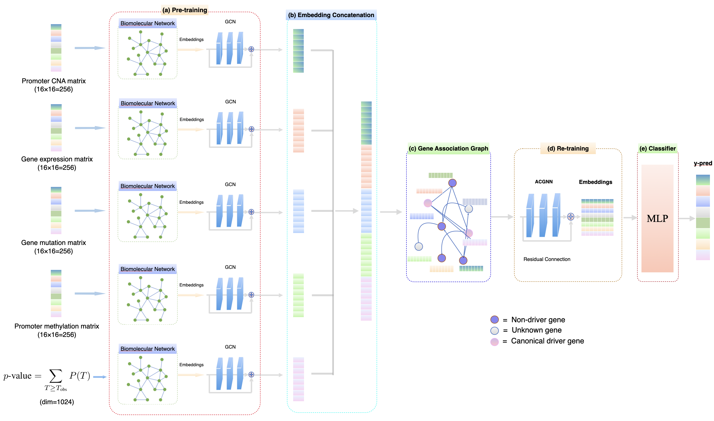

# Adaptive Chebyshev Graph Neural Network for Cancer Gene Prediction with Multi-Omics Integration

This repository contains the code for our paper, "Adaptive Chebyshev Graph Neural Network for Cancer Gene Prediction with Multi-Omics Integration," accepted for presentation at the IEEE International Conference on Bioinformatics & Biomedicine (BIBM) 2024, held from December 3-6, 2024, in Lisbon, Portugal.

## Data Source

The dataset is obtained from the following sources:

- **[STRING database](https://string-db.org/cgi/download?sessionId=b7WYyccF6G1p)**  
- **[HIPPIE: Human Integrated Protein-Protein Interaction rEference](https://cbdm-01.zdv.uni-mainz.de/~mschaefer/hippie/download.php)**  
- **[ConsensusPathDB (CPDB)](http://cpdb.molgen.mpg.de/CPDB)**  

These databases provide curated and integrated protein-protein interaction (PPI) and pathway data for bioinformatics research.

## Setup

-) conda create -n gnn python=3.11 -y

-) conda activate gnn 

-) conda install pytorch::pytorch torchvision torchaudio -c pytorch

-) pip install pandas

-) pip install py2neo pandas matplotlib scikit-learn

-) pip install tqdm

-) conda install -c dglteam dgl

-) pip install seaborn

##
pip install -r requirements.txt

-) conda activate gnn 

-) conda install pytorch::pytorch torchvision torchaudio -c pytorch

-) pip install pandas

-) pip install py2neo pandas matplotlib scikit-learn

-) pip install tqdm

-) conda install -c dglteam dgl

-) pip install seaborn

## Data 
Download the data from the link below and put it the data/multiomics_meth/ before training:

-) https://cbdm-01.zdv.uni-mainz.de/~mschaefer/hippie/download.php

## Get start
python main.py --model_type ACGNN --net_type CPDB --score_threshold 0.99 --learning_rate 0.001 --num_epochs 200
   

