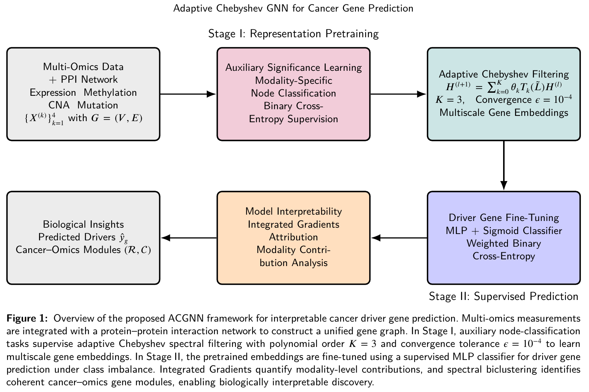

## Adaptive Chebyshev Graph Neural Network for Cancer Gene Prediction with Multi-Omics Integration

This repository contains the code for our project,  
**"Adaptive Chebyshev Graph Neural Network for Cancer Gene Prediction with Multi-Omics Integration,"**  
submitted to the Journal of Bioinformatics Advances.

## Data Source

The dataset is obtained from the following sources:

- **[STRING database](https://string-db.org/cgi/download?sessionId=b7WYyccF6G1p)**  
- **[HIPPIE: Human Integrated Protein-Protein Interaction rEference](https://cbdm-01.zdv.uni-mainz.de/~mschaefer/hippie/download.php)**  
- **[ConsensusPathDB (CPDB)](http://cpdb.molgen.mpg.de/CPDB)**  

These databases provide curated and integrated protein-protein interaction (PPI) and pathway data for bioinformatics research.

## Setup and Get Started

1. Install the required dependencies:
   - `pip install -r requirements.txt`

2. Activate your Conda environment:
   - `conda activate gnn`

3. Install PyTorch:
   - `conda install pytorch torchvision torchaudio -c pytorch`

4. Install the necessary Python packages:
   - `pip install pandas`
   - `pip install py2neo pandas matplotlib scikit-learn`
   - `pip install tqdm`
   - `pip install seaborn`

5. Install DGL:
   - `conda install -c dglteam dgl`

6. Download the data from the built gene association graph using the link below and place it in the `data/multiomics_meth/` directory before training:
   - [Download PPI Network](https://drive.google.com/file/d/1sPcGTU7qCuP1EoDvc4xkMBGEOlSOfE4p/view?usp=sharing)
   - [Download Gene Association Data](https://drive.google.com/file/d/1sPcGTU7qCuP1EoDvc4xkMBGEOlSOfE4p/view?usp=drive_link)

7. To train the model, run the following command:
   - `python main.py --model_type ACGNN --net_type CPDB --score_threshold 0.99 --learning_rate 0.001 --num_epochs 200`

<h2>Citation</h2>

If you find this project useful for your research, please cite it using the following BibTeX entry:

<pre><code>
@misc{LiMaSSRN2026Chebyshev,
  author       = {Li, Sa and Ma, Tianle},
  title        = {Learning Interpretable Gene Representations with Adaptive Chebyshev Graph Neural Networks},
  year         = {2026},
  publisher    = {SSRN},
  doi          = {10.2139/ssrn.6382922},
  url          = {https://ssrn.com/abstract=6382922},
  note         = {Available at SSRN}
}
</code></pre>